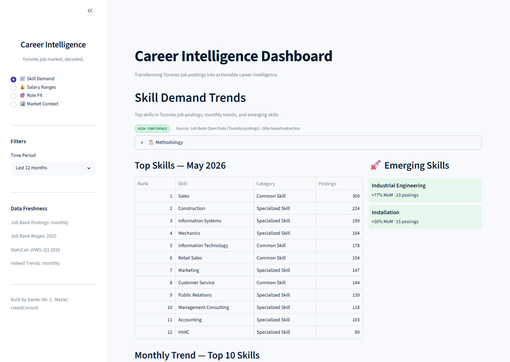

# Career Intelligence Dashboard

> Toronto job market, decoded.

An interactive Streamlit dashboard that turns **real Canadian open data** into actionable
Toronto career intelligence: in-demand skills, salary ranges by role, personal role-fit, and
macro market context. Built end-to-end — data pipeline → analytics → UI — as a portfolio piece
for AI/data workflow consulting.



## What it shows

| View | Question it answers | Primary sources |
|------|---------------------|-----------------|
| **Skill Demand** | Which skills/functions are most in demand in Toronto, and what's emerging? | Job Bank postings |
| **Salary Ranges** | What does each role pay (hourly-equivalent), vacancy-weighted? | Job Bank wages + StatsCan JVWS |
| **Role Fit** | Given my skills, how well do I match current demand, and what are my gaps? | Job Bank postings + Lightcast taxonomy |
| **Market Context** | How is Toronto hiring momentum, vacancies, wage growth, and AI demand trending? | Indeed Hiring Lab + StatsCan |

## Quick start

```bash
# 1. Environment (Python 3.11+)
python -m venv .venv
source .venv/Scripts/activate        # Windows: .venv\Scripts\activate
pip install -e ".[dev]"

# 2. (Optional) Rebuild the data from source — a prebuilt demo DB is already committed.
python scripts/download_job_bank_postings.py --months 6
python scripts/download_job_bank_wages.py --years 2
python scripts/download_indeed_trends.py
python scripts/download_statscan_jvws.py     # skips gracefully if StatsCan is unreachable
python scripts/transform.py                  # builds data/processed/career_intel.duckdb
python scripts/validate.py                   # data-quality gate

# 3. Run the dashboard
streamlit run streamlit_app/app.py
```

The repository ships with a prebuilt `data/processed/career_intel.duckdb` (~7 MB), so the app runs
immediately on a fresh clone without re-downloading anything.

## Architecture

```
downloaders (scripts/)  ──>  data/raw/*.csv  ──>  transform.py  ──>  DuckDB  ──>  insights.py  ──>  Streamlit app
   CKAN / WDS / GitHub        (gitignored)         (idempotent)      (1 file)      (SQL views)      (4 pages)
```

- **`src/pipeline/`** — installable package: `io_utils` (HTTP + encoding/sep detection),
  `noc_mapper`, `skill_taxonomy` (Lightcast), `skill_matcher` (flashtext), `salary`, `insights`.
- **`scripts/`** — downloaders, `transform.py`, `validate.py`.
- **`streamlit_app/`** — `app.py` router + one module per page in `pages_impl/`.

## Data Sources

| Source | Licence | Frequency | Granularity |
|--------|---------|-----------|-------------|
| [Job Bank Postings](https://open.canada.ca/data/en/dataset/ea639e28-c0fc-48bf-b5dd-b8899bd43072) | Open Government Licence – Canada | Monthly | Toronto CMA + GTA |
| [Job Bank Wages](https://open.canada.ca/data/en/dataset/adad580f-76b0-4502-bd05-20c125de9116) | Open Government Licence – Canada | Annual | Economic Region (Toronto ER3530) |
| [StatsCan JVWS 14-10-0444-01](https://www150.statcan.gc.ca/t1/tbl/csv/14100444-eng.zip) | Statistics Canada Open Licence | Quarterly | Economic Region |
| [Indeed Hiring Lab](https://github.com/hiring-lab) | CC-BY-4.0 | Daily/Monthly | Metro (Toronto) + Canada |
| [Lightcast Open Skills](https://lightcast.io/open-skills) | Lightcast Open Skills Terms | Snapshot | ~33K skill taxonomy |
| [NOC 2021 V1.0](https://www.statcan.gc.ca/en/subjects/standard/noc/2021/indexV1) | Statistics Canada Open Licence | Versioned | Occupation classification |

**Attribution:** Contains information licensed under the Open Government Licence – Canada;
Statistics Canada, Table 14-10-0444-01; Indeed Hiring Lab (CC-BY-4.0).

## Methodology & honest limitations

- **Skill extraction is title-based.** Job Bank postings contain **no job-requirements free text**,
  so skills are matched from the job **title** + NOC occupation name. This captures role/function
  demand (Sales, Marketing, IT, Accounting…) well but under-counts tools named only in body text.
  Treat Skill Demand as *occupational* demand, not a full skills census.
- **Salaries are normalized to hourly equivalents** (annual ÷ 2,080) so roles are comparable.
- **StatsCan** is fetched live; the host blocks some non-Canadian egress IPs, in which case the
  downloader skips gracefully and Market Context falls back to Indeed Toronto metro data.

## Deploying

This repo is deploy-ready for [Streamlit Community Cloud](https://share.streamlit.io):
push to a public GitHub repo, point Streamlit Cloud at `streamlit_app/app.py`, and it will install
from `pyproject.toml` and serve the committed demo DB. See `docs/` for the design + plan.

## License

MIT — see [LICENSE](LICENSE).

## Author

Dante (Mr. C. Mezie) — Founder, creedConsult.
