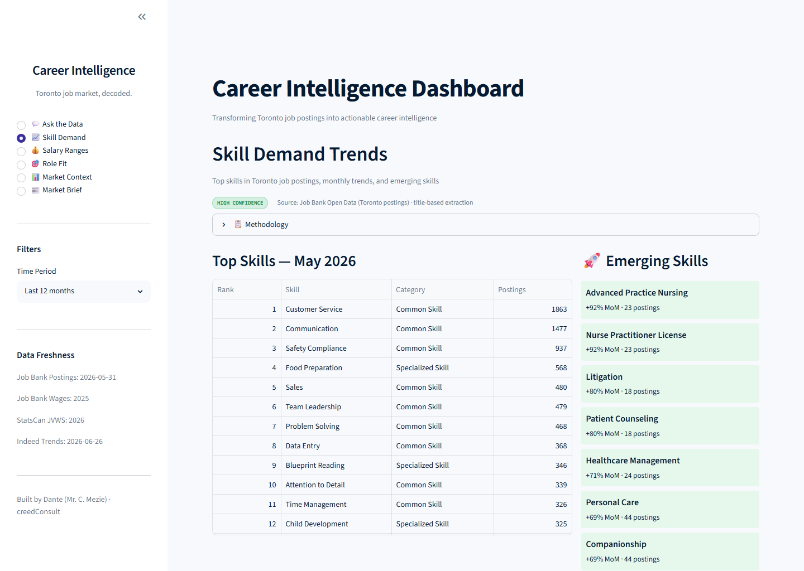

# Career Intelligence Dashboard

[](https://github.com/CREEDCONSULT/-career-intelligence-/actions/workflows/ci.yml)

> Toronto job market, decoded.

An interactive Streamlit platform that turns **real Canadian open data** into actionable career
intelligence — with a **grounded LLM layer** on top: ask questions in plain English, get answers
backed by executed SQL, and auto-generate monthly market briefs whose every number is verified.
Built end-to-end (pipeline → analytics → LLM layer → UI) as a portfolio piece for AI/data workflow
consulting.



## What it does

| View | Question it answers | How |
|------|---------------------|-----|
| **💬 Ask the Data** | Any plain-English question about the market | Grounded text-to-SQL: LLM writes a SELECT, it's validated + executed, and the answer is verified against the result (80% exec accuracy, **0 wrong numbers shown**) |
| **🧠 Career Advisor** | "I'm a cook — what pays more?" open-ended guidance | Plan → grounded-SQL fetch → compose → fact-check; refuses out-of-scope (5/5), 0.91 faithfulness; every answer shows its data sources |
| **📈 Skill Demand** | Which skills are most in demand, and what's emerging? | 12 months of Job Bank postings, dual extraction (dictionary + LLM) |
| **💰 Salary Ranges** | What does each role pay (hourly-equivalent)? | Job Bank wages + StatsCan JVWS, vacancy-weighted |
| **🎯 Role Fit** | Given my skills or resume, where am I competitive? | Skill-overlap scoring **and** semantic profile→role matching (embedded Qdrant hybrid, 8/8 top-5) |
| **📄 Resume Studio** | Upload a resume → fit, review, tailor, cover letter | Token-free PDF/DOCX parsing (markitdown); grounded in demand/salary; never fabricates experience |
| **📊 Market Context** | Hiring momentum, vacancies, wage growth, AI demand | Indeed Hiring Lab + StatsCan time series |
| **📰 Market Brief** | "What happened this month?" — publishable narrative | LLM-narrated over pipeline-computed figures; faithfulness 0.94, 100% numeric grounding |

## The grounding guarantee

**The LLM never emits a figure.** It either generates SQL that is validated (SQLGlot, SELECT-only)
and executed deterministically, or narrates over numbers the pipeline computed — and every number in
the prose is checked against the source result set. Ungrounded output is regenerated or replaced with
plain verified statistics. Measured results in [docs/llm-eval-results.md](docs/llm-eval-results.md).

## Quick start

```bash
# 1. Environment (Python 3.11+)
python -m venv .venv
source .venv/Scripts/activate        # Windows: .venv\Scripts\activate
pip install -e ".[dev]"

# 2. Run the dashboard — a prebuilt 12-month DB (97K Toronto postings) is committed
streamlit run streamlit_app/app.py

# 3. (Optional) LLM features — copy .env.example to .env, add ANTHROPIC_API_KEY
python scripts/make_brief.py          # generate the monthly brief
python scripts/extract_skills_llm.py  # LLM skill extraction (SKILLS_METHOD=llm to use in UI)

# 4. (Optional) Rebuild data from source
python scripts/download_job_bank_postings.py --months 12
python scripts/download_job_bank_wages.py --years 3
python scripts/download_indeed_trends.py
python scripts/download_statscan_jvws.py     # skips gracefully if unreachable
python scripts/transform.py && python scripts/validate.py
```

A GitHub Actions cron ([refresh.yml](.github/workflows/refresh.yml)) refreshes the data monthly and
commits the updated database, validate-gated.

## Architecture

```
downloaders ──> data/raw ──> transform.py ──> DuckDB ──> insights.py ──> Streamlit (6 pages)
 CKAN/WDS/GitHub             (idempotent)       │
                                                └──> src/llm/  (LiteLLM gateway · SQLGlot guard ·
                                                     numeric grounding · response cache · eval harness)
                                                       ├─ ask         (grounded text-to-SQL Q&A)
                                                       ├─ advisor     (plan→fetch→compose→verify chat)
                                                       ├─ brief       (grounded monthly narrative)
                                                       ├─ skills_llm  (batched Haiku extraction)
                                                       └─ role_match  (embedded Qdrant hybrid)
```

- **`src/pipeline/`** — data package: io_utils, market config, NOC mapper, taxonomy, matcher, salary, insights.
- **`src/llm/`** — provider-agnostic LLM layer (Claude default; OpenAI/local via `LLM_PROVIDER`), with
  per-run token budget, prompt caching, daily-cap + session-cap guards on the public Ask page.
- **`config/market.yaml`** — the entire pipeline + UI is parameterized on one market definition.
  Retargeting to another city (Vancouver, Calgary…) is a config change, not a rewrite.

## Data Sources

| Source | Licence | Frequency | Granularity |
|--------|---------|-----------|-------------|
| [Job Bank Postings](https://open.canada.ca/data/en/dataset/ea639e28-c0fc-48bf-b5dd-b8899bd43072) | Open Government Licence – Canada | Monthly | Toronto CMA + GTA |
| [Job Bank Wages](https://open.canada.ca/data/en/dataset/adad580f-76b0-4502-bd05-20c125de9116) | Open Government Licence – Canada | Annual | Economic Region (ER3530) |
| [StatsCan JVWS 14-10-0444-01](https://www150.statcan.gc.ca/t1/tbl1/en/tv.action?pid=1410044401) | Statistics Canada Open Licence | Quarterly | Economic Region |
| [Indeed Hiring Lab](https://github.com/hiring-lab) | CC-BY-4.0 | Daily/Monthly | Metro (Toronto) + Canada |
| [Lightcast Open Skills](https://lightcast.io/open-skills) | Lightcast Open Skills Terms | Snapshot | ~33K skill taxonomy |
| [NOC 2021 V1.0](https://www.statcan.gc.ca/en/subjects/standard/noc/2021/indexV1) | Statistics Canada Open Licence | Versioned | Occupation classification |

**Attribution:** Contains information licensed under the Open Government Licence – Canada;
Statistics Canada, Table 14-10-0444-01; Indeed Hiring Lab (CC-BY-4.0).

## Methodology & honest limitations

- **Job Bank postings contain no requirements free-text.** The dictionary extractor works from job
  titles + NOC names; the LLM extractor additionally surfaces *implied* competencies ("Barista" →
  customer service, cash handling). Both are role/function-level demand, not a full skills census.
- **Salaries are normalized to hourly equivalents** (annual ÷ 2,080) so roles are comparable.
- **Every LLM output is verified** before display — see the grounding guarantee above.
- **StatsCan** may block some non-Canadian egress IPs; the downloader skips gracefully and Market
  Context falls back to Indeed Toronto metro data.

## Deploying

Deploy-ready for [Streamlit Community Cloud](https://share.streamlit.io) (point at
`streamlit_app/app.py`) or Railway (Dockerfile + `railway.toml` included). Set `ANTHROPIC_API_KEY`
in the deploy environment to enable the LLM features; without it, the data views still work and the
LLM pages degrade gracefully. Public-deploy cost guards: `ASK_SESSION_LIMIT` (default 10 questions)
and `ASK_DAILY_TOKEN_CAP` (default 200K tokens/day).

## License

MIT — see [LICENSE](LICENSE).

## Author

Dante (Mr. C. Mezie) — Founder, creedConsult.
