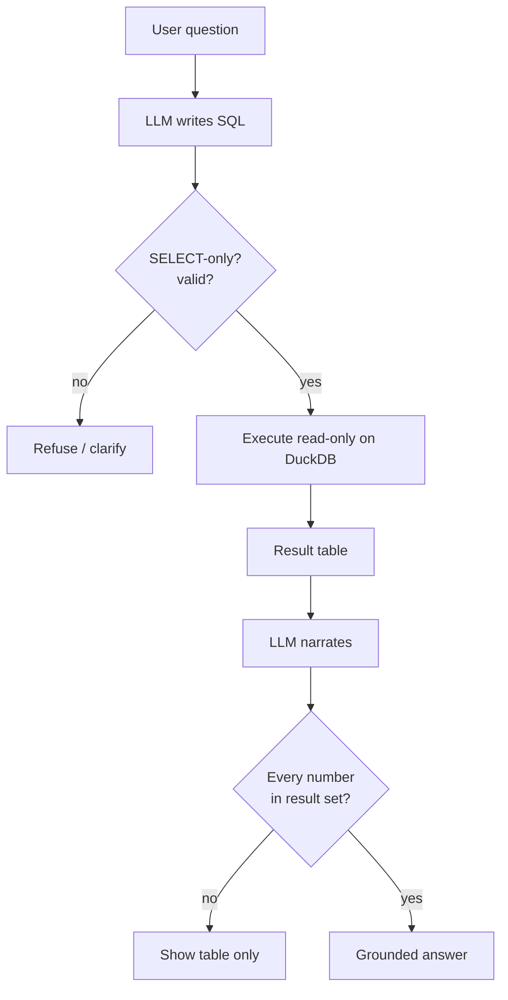

# Architecture Diagram Prompts

For the "how it's built" visuals. These are **diagrams** — best drawn in Figma/Excalidraw/Mermaid
with the design tokens, or generated as abstract backgrounds and labeled in a design tool. Text in
diagrams should be added by hand for legibility.

**Shared tokens:** background #071018, grid #29384C, cards #0B1520 with 1px #29384C border + 16px
radius, gold #D5B56E accents/arrows, blue #7CB4FF for AI/data, green #8EE0B2 for verified, cream
#F7F1E8 labels, mono for labels/numbers.

---

## Diagram A — The six-layer stack (hero architecture)
Vertical stack of six labeled cards, top to bottom:
1. **DATA** — Job Bank · Statistics Canada · Indeed Hiring Lab · Lightcast · NOC 2021
2. **ANALYTICS** — skills · salaries · role demand · trends
3. **AI (GUARDED)** — text-to-SQL · grounding · refusal  *(blue left-border + shield badge)*
4. **UX** — 8 modules
5. **EVALUATION** — accuracy · faithfulness · refusals  *(green ticks)*
6. **PRODUCTIZATION** — Phase 0 → 6  *(gold "you are here" on Phase 0)*
Thin gold connectors between layers. One ghosted orb behind. Caption: "The model lives in one layer."

## Diagram B — Data pipeline (left-to-right)
`5 source chips → [ingest/normalize] → [DuckDB store] → [analytics: insights] → [8 UI modules]`
Arrows gold; the store is the visual anchor (largest card). Small labels: "official sources",
"clean + joined", "one queryable store". No AI in this diagram — it's the foundation.

## Diagram C — The grounded text-to-SQL loop (the guardrail flow)
A cycle/pipeline:
`Question → [LLM writes SQL] → [SQLGlot validate: SELECT-only] → [execute read-only on DuckDB]
→ result table → [LLM narrates] → [numeric-grounding check: every number ∈ result set]
→ Answer  |  else → Refuse / show table only`
Validate + grounding checkpoints are shield badges; the refusal branch forks off in muted red;
the "number matched" link is a thin gold line from answer to a result cell. This is the money diagram.

## Diagram D — Provider-agnostic AI gateway
Center card **LLM Gateway (LiteLLM)** with: token budget · prompt caching · retries. Three swappable
model chips feeding in (Claude / OpenAI / local), and out to the feature modules (Ask, Advisor,
Brief, Resume, Skills). Caption: "Swap the model without touching the system."

## Diagram E — Trust scorecard (evaluation)
Horizontal 5-tile scorecard, each tile = metric + mono number + green tick:
`Text-to-SQL accuracy 80%` · `Invented numbers shown 0` · `Brief faithfulness 0.94` ·
`Out-of-scope refusals 5/5` · `Resume→role top-5 8/8`. Caption: "Measured, not asserted."

## Diagram F — Before / after ("chatbot vs product")
Two side-by-side panels:
- **Chatbot** (muted): Question → Model → Answer (a number highlighted red "unverified").
- **AI product** (gold/blue): Question → SQL → Data → Verified Answer (green tick).
Caption: "A chatbot improvises. A product refuses."

---
**Mermaid starter (Diagram C)** — paste into a Mermaid renderer, then restyle to tokens:

